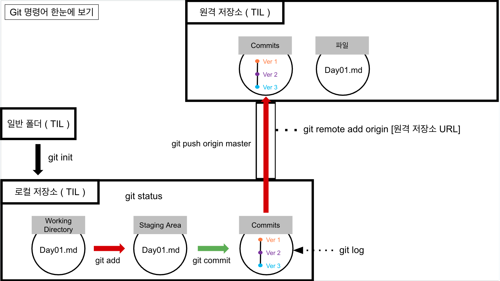

# git 기초 퀴즈
## 1. git의 사전적 정의는 "(중앙) 버전 관리 프로그램"이다.
   - 답 : X
   - 이유 : (분산) 버전 관리 프로그램
## 2. git의 3공간은 working directory, staging area, repository 이다.
   - 답 : O
   - 이유 : working directory, staging area, repository 이다.
## 3. github 에 버전을 저장하기 위해 git commit 명령어를 쓴다.
   - 답 : X
   - 이유 : 
     - github 은 버전 관리 호스팅 서비스
     - git commit은 
       - **변경사항의 기록**을 남기는 역할을 합니다.
       - 버전관리를 할 수 있도록 합니다.
## 4. git log 를 통해 버전 기록들의 목록을 확인할 수 있다.
   - 답 : O
   - 이유 : 
     - git log를 통해, 이전에 남긴 변경사항의 기록들을 확인할 수 있습니다.
     - 단, 변경사항의 내역은 육하원칙에 따라 정리되어 있기 때문에,
     - 보편적으로 `git log --oneline` 옵션을 함께 사용합니다.
## 5. 버전을 기록하는 프로세스는 git add -> git commit 이다.
   - 답 : O
   - 이유 -> 버전 기록을 위해서는 3공간을 오갈 수 있는 `git add`, `git commit` 명령어를 사용한다.
     - 그외 명령의 목적은 다음과 같다.
       - git log : 버전의 기록 내역 확인
       - git status : 파일의 상태를 살핀다.
## . 변경사항은 6하원칙에 따라 직접 남겨야 한다.
   - 답 : X
   - 이유 : 커밋메시지(이유)를 제외하고는 나머지는 버전관리프로그램인 git이 자동으로 채워준다.

